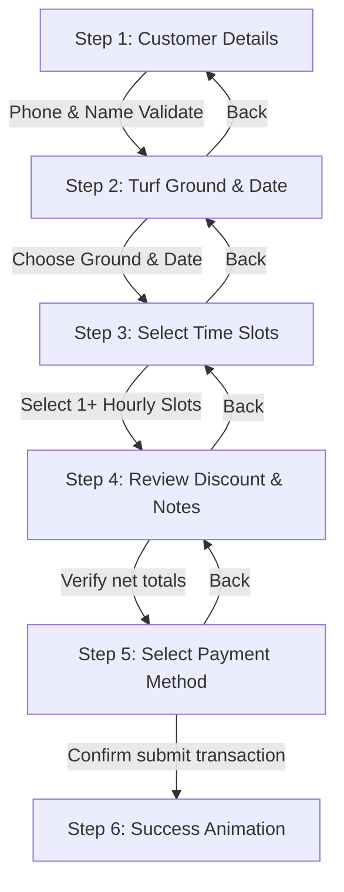

# 360 Club Box - Project Architecture & Technical Specification (BRAIN.md)

This document serves as the single source of truth for the **360 Club Box** Turf Booking & Management Dashboard. It details the system architecture, workflows, configurations, state management, business logic, security constraints, and operational warnings to enable any developer or AI agent to maintain, debug, and expand the project with full confidence.

---

## 1. System Overview

**360 Club Box** is a premium turf booking and administration dashboard designed to manage reservations, customer profiles, payment logging, and business performance metrics for a box cricket facility. 

### Core Personas & Roles
- **Owner Admin (`admin`)**: Full operational access. Can configure rates, manage partners (staff), override bookings, record transactions, apply discounts, and generate financial reports.
- **Partner Staff (`partner`)**: Operational staff account. Has read/write access to scheduler inputs (excluding master settings and rate management) and holds view-only access in restricted ledger areas.

### Database Fallback Architecture
The system supports a **Hybrid Data Layer**:
1. **Supabase Database Mode**: Connects to Supabase Postgres instance via `@supabase/supabase-js` if environment credentials (`NEXT_PUBLIC_SUPABASE_URL` and `NEXT_PUBLIC_SUPABASE_ANON_KEY`) are present.
2. **Local Mock Storage Fallback Mode**: If Supabase variables are absent or connection fails, the system automatically redirects operations to a client-side mock database (`mock-db.ts`) persisted in `localStorage`. This local model fully implements database queries, table joins, soft-deletes, and transaction conflicts in memory.

---

## 2. Technology Stack & Directory Structure

```
├── .next/                   # Next.js Build Output
├── .open-next/              # OpenNext Compilation for Cloudflare Pages
├── patches/                 # Package patches (e.g., node_modules fixes)
├── public/                  # Static Assets (logo.png, etc.)
├── supabase/
│   └── schema.sql           # Database schema migration statements
├── src/
│   ├── app/                 # Next.js App Router (v16) pages and globals
│   │   ├── bookings/        # Turf Scheduler & 6-Step reservation wizard
│   │   ├── customers/       # Customer directories & profile lookups
│   │   ├── dashboard/       # Metric cards, audit streams, trend charts
│   │   ├── login/           # Compact user authentication page
│   │   ├── payments/        # Live ledger entries 
│   │   ├── reports/         # PDF generator triggers for revenue/audits
│   │   ├── settings/        # Master configurations (rates, partners)
│   │   ├── globals.css      # Core styles & Tailwind CSS v4 variables
│   │   ├── layout.tsx       # Root layout configuration
│   │   └── page.tsx         # Gateway entry route redirector
│   ├── components/          # Shared components (Layout, UI, Charts)
│   │   ├── dashboard/       # Recharts area/bar charts wrappers
│   │   ├── layout/          # Sidebar navigation container
│   │   └── ui/              # Radix/custom layout primitives
│   └── lib/                 # Service layers, stores, and utilities
│       ├── db/
│       │   ├── db-service.ts# DB service layer routing (Supabase vs LocalStorage)
│       │   ├── mock-db.ts   # Local Storage client-side simulated DB
│       │   └── types.ts     # TypeScript database models definitions
│       ├── pdf-generator.ts # Reports and receipts pdf compiling engine (jspdf)
│       ├── security.ts      # XSS sanitization and local rate limiting
│       └── store/
│           ├── auth-store.ts# Zustand user login/role session management
│           └── toast-store.ts# Zustand global notification toast management
├── wrangler.jsonc           # Cloudflare deployment settings
├── next.config.ts           # Next.js bundler settings
└── package.json             # NPM package declarations
```

---

## 3. Database Schema (`supabase/schema.sql`)

The database consists of 6 primary tables representing core business operations:

```mermaid
erDiagram
    users {
        uuid id PK
        varchar email
        varchar role
        timestamp created_at
    }
    grounds {
        uuid id PK
        varchar name
        decimal hourly_rate
        timestamp created_at
    }
    customers {
        uuid id PK
        varchar name
        varchar phone UNIQUE
        timestamp created_at
    }
    bookings {
        uuid id PK
        uuid customer_id FK
        uuid ground_id FK
        date booking_date
        time start_time
        time end_time
        decimal amount
        decimal discount
        decimal final_amount
        varchar status
        text notes
        timestamp created_at
        timestamp deleted_at
    }
    payments {
        uuid id PK
        uuid booking_id FK
        decimal amount_paid
        varchar payment_method
        varchar payment_status
        timestamp payment_date
    }
    activity_logs {
        uuid id PK
        text action
        varchar user_email
        timestamp created_at
    }

    customers ||--o{ bookings : "has"
    grounds ||--o{ bookings : "has"
    bookings ||--o{ payments : "logs"
```

### Table Column Details
- **`users`**: Extension of `auth.users` profile. Role is checked to be strictly in `('admin', 'partner')`.
- **`grounds`**: Turf boxes data (e.g. Ground A/Box 1 or Ground B/Box 2). 
- **`customers`**: Unique mobile number index constraint to prevent duplicate registrations.
- **`bookings`**: Main reservation ledger. Supports soft-delete through `deleted_at` field (cancelled reservations are flagged rather than dropped).
- **`payments`**: Payment ledger linking amounts paid to specific booking transactions.
- **`activity_logs`**: System audit trail mapping operations back to the acting user's email.

---

## 4. Key Workflows & State Management

### 4.1. The 6-Step Booking Wizard
The booking drawer inside [bookings/page.tsx](file:///c:/Users/dhame/Desktop/box%20system/src/app/bookings/page.tsx) uses a custom-designed state flow to capture registrations cleanly on mobile:



- **Step 1: Customer details**: Admin can search for existing customers by typing a name or phone number. Auto-suggest list matches queries dynamically from local memory. Focus on inputs triggers a mobile-friendly layout and prevents auto-zooming.
- **Step 2: Turf Ground & Date**: Selects target box ground (Box 1 Premium vs Box 2 Standard) and reservation date from calendar. Changing ground or date automatically flushes the slots array to prevent invalid state carried over.
- **Step 3: Slots Grid**: Displays available slots in a responsive grid (`grid-cols-2` on mobile, `md:grid-cols-4` on desktop) for that target day and ground. Booked slots are blocked out.
- **Step 4: Review**: Displays invoice summary, allows applying arbitrary discounts, and logs notes.
- **Step 5: Payment Method**: UPI, Cash, or Split payments. In split payment mode, fields validate that `UPI split` + `Cash split` matches the Net Payable bill exactly.
- **Step 6: Success**: Triggers a Lottie animation confirming the slot locking and payment records.

### 4.2. Time Overlap Validation
Double-booking prevention is enforced via slot boundary verification (`checkTimeConflict` in mock-db and database query):
```typescript
const conflict = activeBookings.some(b => {
  return startTime < b.end_time && endTime > b.start_time;
});
```
This overlapping check prevents overlap where the start time of the new booking falls before the end time of an existing booking, and its end time falls after the start time of that booking.

### 4.3. Customized Slot Pricing Rules
Slot prices are calculated in real-time inside `getSlotPrice` based on Ground ID, date, and hour slot.
- **Rules Mapping**:
  - **Weekday Daytime (6 AM - 6 PM)**
  - **Weekday Nighttime (6 PM - 6 AM)**
  - **Weekend Daytime (6 AM - 6 PM)**
  - **Weekend Nighttime (6 PM - 6 AM)**
- **Storage**: Customized rules are stored in localStorage key `turf_slot_pricing` indexed by ground ID.
- **Default fallback**:
  - Ground A (Premium): Weekday (Day: 600, Night: 1000) / Weekend (Day: 700, Night: 1200)
  - Ground B (Standard): Weekday (Day: 500, Night: 800) / Weekend (Day: 600, Night: 1000)

---

## 5. Security & Operation Safeguards

### 5.1. XSS Input Sanitization
Any user inputs stored directly (such as names, phone numbers, email addresses, and notes) are run through the `sanitizeInput` method inside `src/lib/security.ts` to escape tags and double/single quotes.

### 5.2. Sliding-Window Rate Limiting
To prevent rapid form submissions or script-injection spamming, a rate limiter utilizes `localStorage` array timestamps (`checkRateLimit`):
- **Login attempts**: Max 5 attempts per 60 seconds. Exceeding triggers a localized lockout timer.
- **Payment logs**: Max 5 logs per 10 seconds to avoid duplicate ledger entries.

---

## 6. What Can Break & Maintenance Warnings

> [!WARNING]
> ### 1. Schema Syncing Requirement
> If columns are added or renamed in `schema.sql`, you **must** update the corresponding type definitions in `src/lib/db/types.ts` AND structural seeding logic inside `src/lib/db/mock-db.ts`. Failing to align mock storage will break the local database fallback, causing fatal application crashes.
> 
> ### 2. Time Slot Formatting
> System calculations treat hours as strict `'HH:MM'` strings (e.g. `'06:00'`). Changing format structure (such as changing slot keys to integers, or shifting to 12-hour notations in the database) will corrupt time conflict comparisons, enabling accidental double bookings.
> 
> ### 3. Mobile Viewport Typing Zoom
> Input fields must retain a minimum font size of `16px` on mobile screens to prevent automatic browser zoom in mobile Safari and Chrome. Ensure input fields have class `text-[16px] sm:text-xs` (or `sm:text-sm`) to preserve this safeguard.
> 
> ### 4. Split Payment Validation
> The checkout flow strictly requires that the total split fields match the final invoice down to the rupee. Any adjustments to net calculations must ensure `calculatedFinalAmount()` matches `Number(upiSplitAmount) + Number(cashSplitAmount)` or submission triggers validation blockers.
> 
> ### 5. Dialog Fixed Dimensions
> The booking wizard modal utilizes a strict fixed-height container styling. Adding content that exceeds the default dimensions requires increasing the height limits or enabling scrollbars on localized containers. Modifying height parameters dynamically between steps will cause UI sizing jumps, leading to page scaling bugs on mobile layout viewports.
